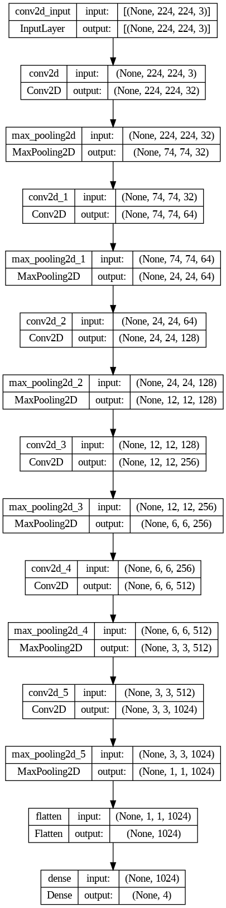
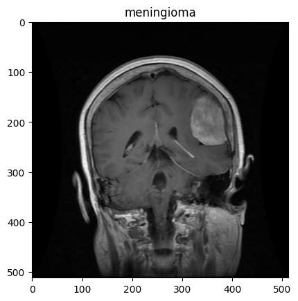
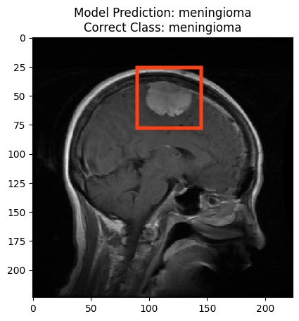
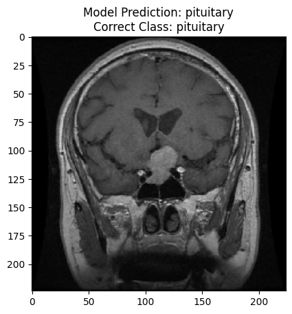

# Overview

A brain tumor is a cluster of abnormally fast growing cells located in the brain. Due to the restrictive nature of the skull and inability to flex, a mass growing at an accelerated rate can put pressure on the cranium and brain tissue, leading to life-threatening health complications.

As a result, it is best to identify malignant growths early on and with precision before it has progressed a significant amount.

Regular MRI screenings are an effective way at identifying cancerous growths. Yet, the diagnosis and classification by a human physician can sometimes be inaccurate due to the complexities in the properties and appearances of brain tumors.

## The Model

A convolutional neural network, specialized for imagiing data, is proposed here to interpret and classify the MRI scan data.

Using 6 convolution and max pooling layers, the model has 2,851,652 trainable parameters designed to adapt to the complexity of MRI data.

### Model Architecture


### Hyperparameters
* Loss function: Categorical Cross Entropy
* Optimizer: Adaptative Moment Estimation with a learning rate of 0.003
* Metrics: Categorical accuracy


## Performance

The model performs at **91.62%** accuracy on the test set, with a slightly higher 94.03% training accuracy. It generalizes well to unseen data, giving it real-world applicability.

## Data

A dataset of 7023 MRI images was used in training this model. 

It contains four distinct classes:

* Glioma
* Meningioma
* Pituitary
* No Cancer

The data was split into the training and validation set with a 80/10/10 ratio. Batch sizes were set to be 32 images and training data was shuffled.

A sample image that may be fed into the model would appear to look like



For preprocessing the data, it was augmented in order to prevent overfitting of the model and artificially inflate the data size. The tensor representations of the images were normalized with min-max noramlization by their RGB values.

### Augmentation
* Rotation range of 20
* Width shift range of 0.2
* Height shift range of 0.2
* Shear range of 0.2
* Zoom range of 0.2
* Horizontal flip applied

## Output

The model outputs a probability for each of the four classes, outputting a rational ranging from 0-1 corresponding to the decimal probability that the MRI scan displays a tumor or a certain type of tumor. The highest probability class will be chosen as the final answer

### Examples

The red box highlights what the model has learned to look for in the scans



## Trying the Model

To try the model, download the TumorConvModel folder and load it into your desired directory.


Install required libraries and load the model
```python
import tensorflow as tf
import matplotlib.pyplot as plt

model = tf.keras.models.load_model('TumorConvModel_file_directory')
```

Since our image shape is 224x224, we need to preprocess our image before feeding it to the model

```python
image = tf.io.read_file('image_file_directory')

# Decode the read file into a tensor and set it to have 3 color channels
image = tf.image.decode_image(image, channels=3)

# Resize the image to 224x224
image = tf.image.resize(image, size = [224, 224])

# Min-max normalize image data
image = image/255.
```

Finally, we can generate the model predictions

```python
class_directory = {0 : 'glioma',
                   1 : 'meningioma',
                   2 : 'notumor',
                   3 : 'pituitary'}

model_prediction = model.predict(tf.expand_dims(image, axis=0))
classification = class_directory.get(round(np.argmax(model_prediction)))

plt.imshow(image)
plt.title("Model Prediction: " + classification)
```

## License

[MIT](https://choosealicense.com/licenses/mit/)
